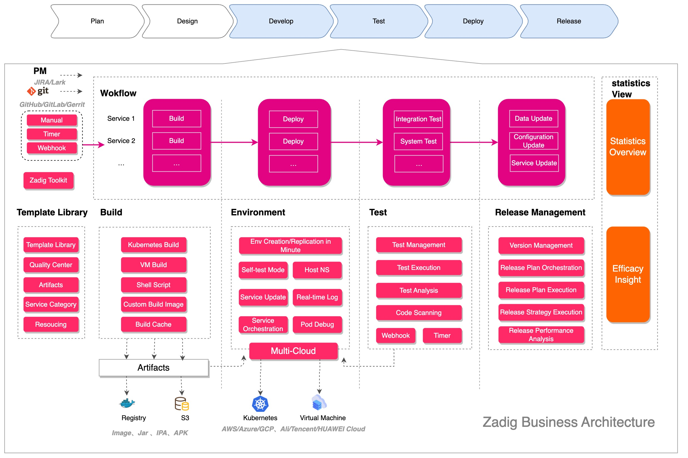

<h3 align="left">AI-powered, cloud-native, distributed DevOps platform designed for developers</h3>

⁣

[?style=for-the-badge>)](https://www.koderover.com/?utm_source=github&utm_medium=zadig_readme)
[?style=for-the-badge>)](https://www.koderover.com/trial/?utm_source=github&utm_medium=zadig_readme)

**English | [简体中文](./README-zh-CN.md)**

## Table of Contents

- [Table of Contents](#table-of-contents)
- [What is Zadig](#what-is-zadig)
- [Quick start](#quick-start)
  - [How to use?](#how-to-use)
  - [Bootcamps](#bootcamps)
  - [How to make contribution?](#how-to-make-contribution)
- [Getting help](#getting-help)
- [License](#license)

## What is Zadig

Zadig is a self-service cloud-native DevOps platform developed by KodeRover based on Kubernetes. Zadig provides flexible and scalable workflow support, multiple release strategy orchestrations, and one-click security audits, and continuously optimizes the R&D process through intelligent capabilities such as AI environment inspections, AI performance diagnosis, and AI Pilot. The platform also supports customized enterprise-level XOps agile performance dashboards, deeply integrates multiple enterprise-level platforms, and quickly accesses thousands of services in batches through project templates, achieving one-click management and governance of thousands of services.

Its main goal is to help enterprises realize the digital transformation of production and research, enable engineers to become innovation engines, and provide support for the unlimited value links of the digital economy.

> Our vision is: Developer + Zadig = Business success

The business architecture is as follows:

For more details about system architecture, see [Zadig System Architecture Overview](System-Architecture-Overview.md).

The Highlighted Features:

  
<b>High Concurrency</b>

  Based on cloud-native design, through simple configuration, the system automatically generates workflows to achieve high concurrent execution for continuous delivery relevant tasks such as building, testing and deployment, across multiple services. It significantly improves the efficiency of multi-services deployment in microservice architecture.
  

  
<b>Service-oriented Environment</b>

  With just one set of service configuration, multiple encapsulated environments will be provided automatically within minutes, empowering independent environments for developers, QAs and product managers.

  Minimum to none migration cost of existing environments -- just hosting with one click, the system allows browsing and adjusting all the services at your fingertips.
  

  
<b>Non-intrusive Testing Automation</b>

  Zadig can easily and non-intrusively embed existing testing automation frameworks, and achieve continuous building, testing and deployment via GitHub/GitLab Webhook.

  It also integrates with productivity bots to provide instant quality report, which effectively applies shift-left testing best practices.
  

  
<b>Powerful Template Library</b>

  Shared K8s YAML templates, Helm Chart templates, build templates, etc., across projects to achieve unified configuration management. Based on a set of templates, hundreds of microservices can be created, and with minimal configuration by development engineers, self-service usage is enabled, significantly reducing the burden of operations and maintenance management.
  

  
<b>Secure and Reliable Release Management</b>

  Customized workflows that integrate engineer, process, and internal and external system compliance approvals, supporting flexible orchestration of deployment strategies such as blue-green deployment, canary release, phased gray release, and Istio release. Presenting the state of the production environment from a multi-cluster, multi-project perspective, it achieves transparency and reliability in the release process.
  

 
<b>Stable and Efficient Customer Delivery</b>

  Simplify the implementation process for vendors to customer versions, customer private clouds, public clouds, and offline environments, as well as product license management. The supplier management plane collaborates with the customer console to complete the implementation, update, and maintenance process for customer environments, enhancing the quality of external services provided by the enterprise.
 

  
<b>Objective and Accurate Performance Insights</b>

  Comprehensive understanding of the system's operational status, including data overviews on clusters, projects, environments, workflows, and key process pass rates. It provides objective performance metrics data for various aspects like builds, tests, and deployments at the project level, enabling precise analysis of development efficiency bottlenecks and promoting steady improvement.
  

  
<b>AI-Driven Efficiency Diagnosis · Environment Inspection · Pilot Assistant</b>

  Deeply integrated with AI capabilities, it delivers three core functions: AI Efficiency Analysis, AI Environment Inspection, and Zadig Pilot. By intelligently analyzing data from pipelines, builds, tests and other workflow stages, it precisely identifies efficiency bottlenecks and provides actionable improvement suggestions. The system performs regular comprehensive inspections of Kubernetes environments to detect and warn about potential issues, ensuring environmental stability.

  With enterprise-level round-the-clock technical support for instant response - spanning technical consultation to fault resolution - it serves as an essential AI assistant for development teams.
  

## Quick start

### How to use?

Please follow [Quick Start](https://docs.koderover.com/zadig/quick-start/introduction/)

### Bootcamps

With many hands-on tips, case studies and demos of different application types, Zadig [bootcamp](https://github.com/koderover/zadig-bootcamp) gives developers easy to follow best practices in a cloud native CI/CD solution

Just follow [Tutorials](https://koderover.com/tutorials) to try it step by step.

### How to make contribution?

Please check out [our contributing guideline](CONTRIBUTING.md).

## Getting help

- More about Zadig, see [here](https://docs.koderover.com?type=zadig)
- Submit bugs or feature requests following [contributing instructions](CONTRIBUTING.md#contribution-option-1---reporting-an-issue)
- Email：contact@koderover.com
- [Slack channel](https://join.slack.com/t/zadig-workspace/shared_invite/zt-qedvct1t-mQUf2eyTRkoVCc_RWKKgxw)

## License

[Apache 2.0 License](./LICENSE)
