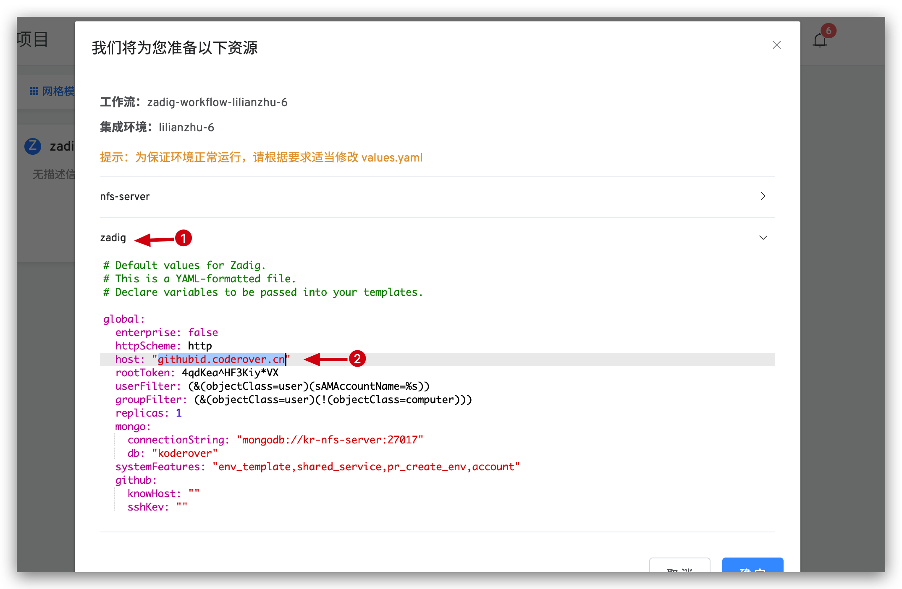

# Zadig 开发流程

## 1. 克隆代码
1. 在 [koderover/Zadig](https://github.com/koderover/zadig) 仓库，点击右上角的 Fork 按钮。
2. 将 fork 后的代码仓库克隆到本地
```bash
git clone git@github.com:<your_github_id>/zadig.git
```
## 2. 本地开发环境搭建

### 前端环境

Zadig 前端使用的 vue 框架，在您贡献代码之前，本地需安装 Node.js 10+、Yarn 以及 NPM 7+。

注意：我们使用 Yarn 进行依赖版本的锁定，所以请使用 Yarn 安装依赖。

### 后端环境

Zadig 后端使用 Go 语言，在您贡献代码之前，本地需安装 Go 1.15+ 版本。

## 3. 贡献代码

请详细阅读 [代码贡献指南](../../CONTRIBUTING-zh-CN.md) 并遵循上面的流程。

## 4. 调试

Zadig 为您提供云上测试环境 [https://os.koderover.com](https://os.koderover.com)。

第 1 步：GitHub OAuth 登录系统

第 2 步：Fork Zadig 项目

点击 zadig 选项，将其中的 global.host 中的 `githubid` 改成您的 GitHub ID，否则可能无法访问。



Fork 完成后，您将获得一个 Zadig 测试环境。

第 3 步 ：测试

您可以使用两种测试方式：云上代码测试和本地代码测试。

### 方式一：云上代码测试

需先提交您的代码，并创建 pull request，调试过程中的 pull request 标题建议加上 WIP。然后使用 [zadig-workflow](https://os.koderover.com/v1/projects/detail/zadig/pipelines/multi/zadig-workflow) 更新您的测试环境。

启动工作流任务需要
1. 选择您代码变更涉及到的服务
2. 选择您提交的 pull request

工作流成功执行后，您可以进入测试环境进行调试。

### 方式二：本地代码测试

#### 前端本地测试

请确保您的测试环境正常运行，在开始测试之前请将 `zadig-portal/config/index.js` 中的 backEndAddr 改为您测试环境的访问地址。
```
cd zadig-portal
yarn install
yarn run dev
```
访问 http://localhost:8080 进行本地调试。

#### 后端本地测试

使用 Zadig CLI 进行本地调试，使用方式参见 [Zadig CLI 使用指南](https://docs.koderover.com/zadig/cli/kodespace-usage-for-contributor)

